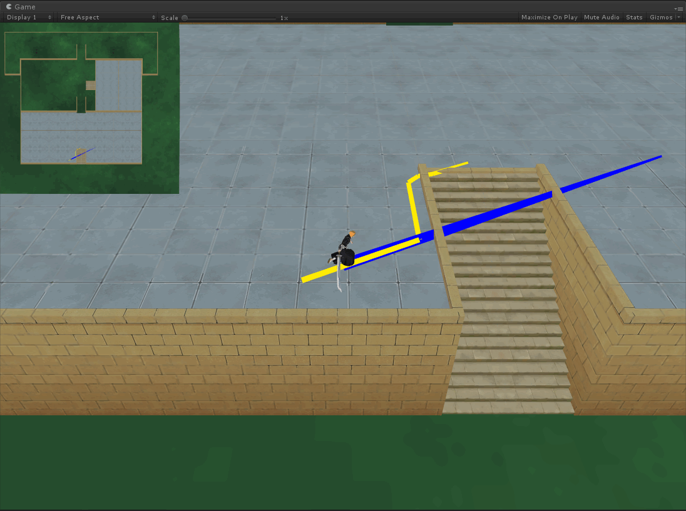
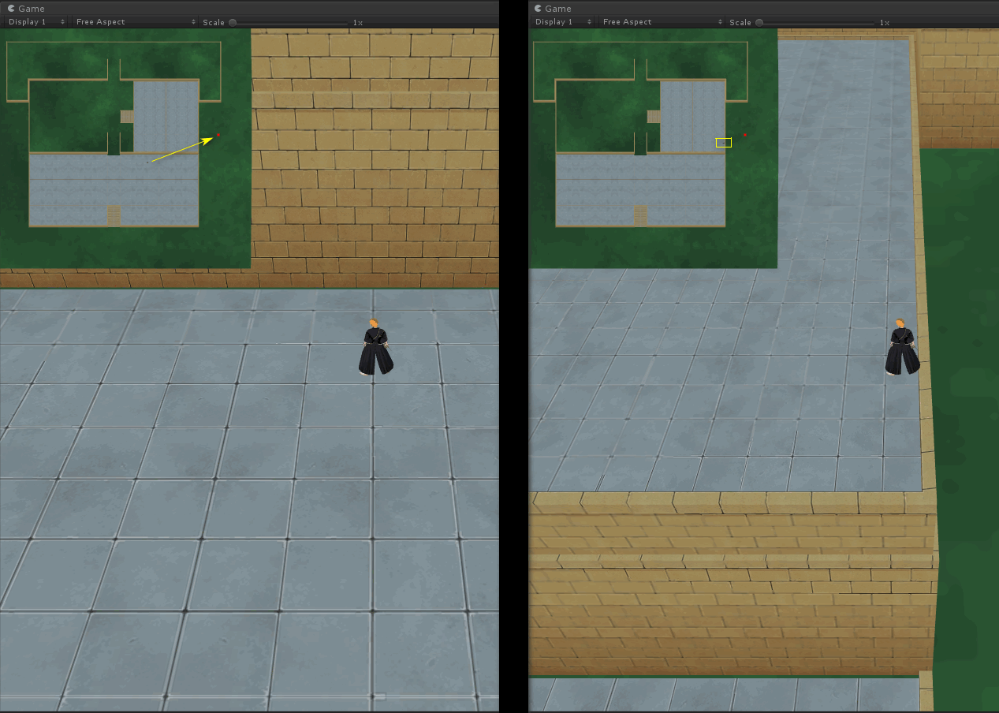
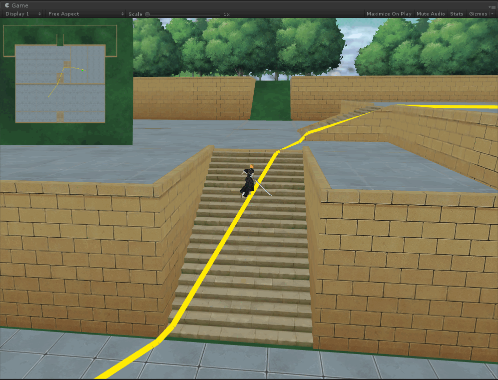

之前做的项目都是使用以方格为基础的地图系统，但是随着游戏开发的深入，方格对于斜线的无力越来越明显，逻辑处理起来也很复杂低效。
Unity自带的NavMesh很容易解决这方面的问题，而且正常情况下多边形数量远小于方格数量，寻路速度较快，甚至可以提前保存结果避免动态寻路。
但是由于底层不开源，无法提供给服务端使用，也不好针对项目进行优化和扩展。所以我自己实现了一个多边形地图系统，主要针对项目的这些功能：

1.最基本的需求，两点间寻路

2.按固定距离直走，遇到边界沿着边滑行

3.闪现到任意位置，如果遇到不能走的点找最近的点

4.地形要能上下起伏走斜坡，服务端只需要平面就行

5.需要有动态阻挡，开启后才能进入下一个区域

目前这些功能都已经实现，[game.unity](https://github.com/genechiu/NavMesh/tree/master/Assets/Scenes)是一个完整的演示，
