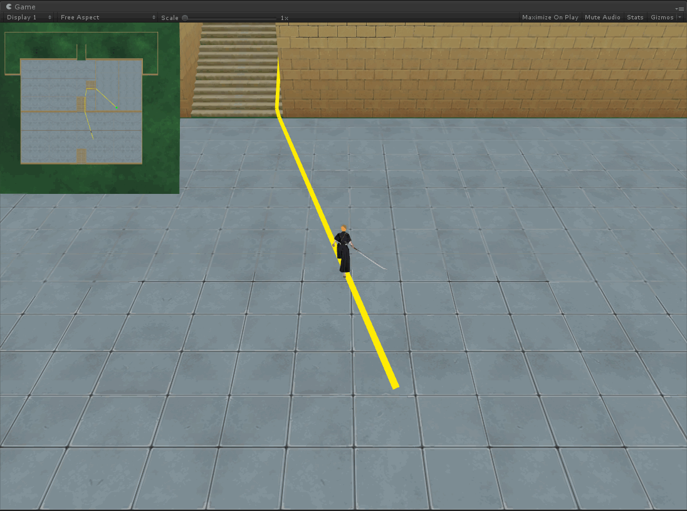
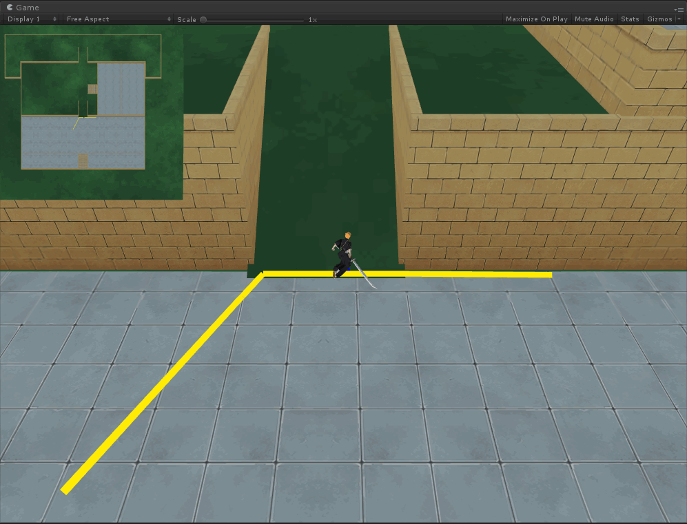
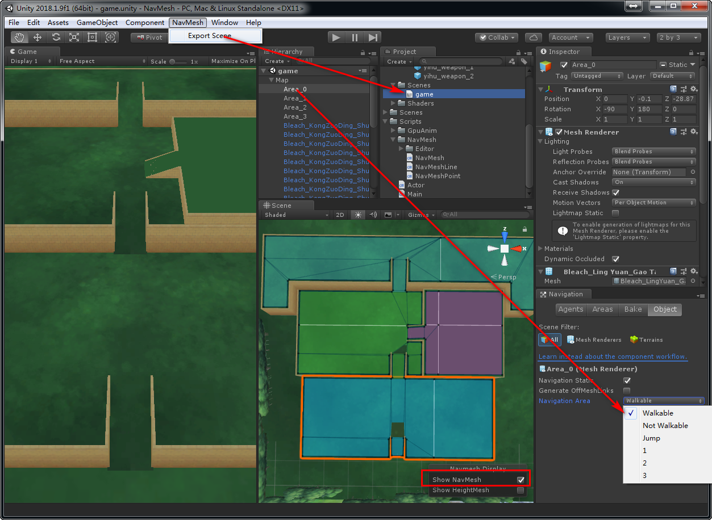
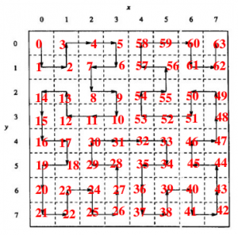
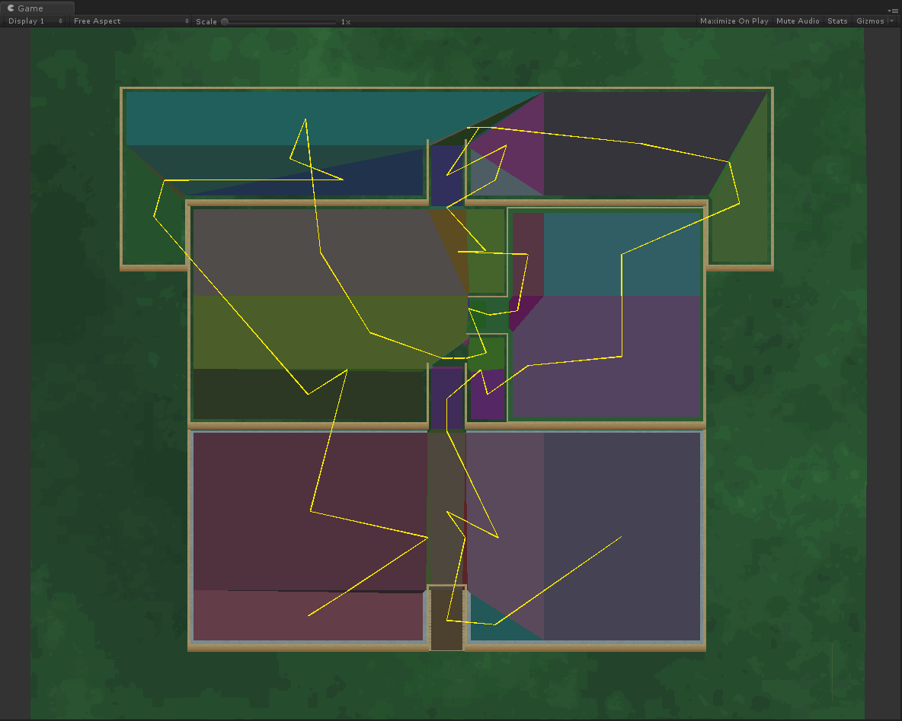
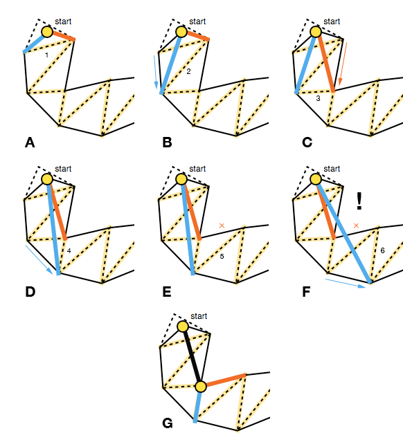
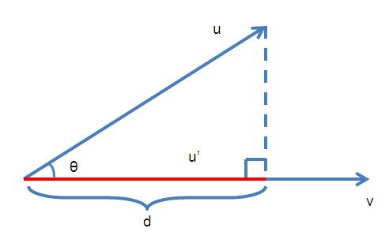
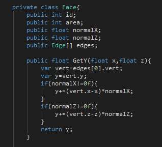

#### 特性
之前做的项目都是使用以方格为基础的地图系统，但是随着游戏开发的深入，方格对于斜线的无力越来越明显，逻辑处理起来也很复杂低效。
Unity自带的NavMesh很容易解决这方面的问题，而且正常情况下多边形数量远小于方格数量，寻路速度较快，甚至可以提前保存结果避免动态寻路。
但是由于底层不开源，无法提供给服务端使用，也不好针对项目进行优化和扩展。所以我自己实现了一个多边形地图系统，主要针对项目的这些功能：

1. 最基本的需求，两点间寻路

2. 按固定距离直走，遇到边界沿着边滑行

3. 闪现到任意位置，如果遇到不能走的点找最近的点

4. 地形要能上下起伏走斜坡，服务端只需要平面就行

5. 需要有动态阻挡，开启后才能进入下一个区域

[game.unity](https://github.com/genechiu/NavMesh/tree/master/Assets/Scenes)是一个完整的演示，左右键点击小地图创建人物和行走，中键调整镜头，WASD可以控制行走，空格开启下一个区域。

#### 遇到的问题和采用的解决方案
首先多边形的创建直接使用Unity作为编辑器，操作起来简单方便，生成的数据也可以写工具转换成自己需要的格式，服务端也可以用。
但是这样就没法运行时动态修改地形了，不过由于本身地形重建效率太低，同时还要处理单位从可走变成不可走后，坐标修复的问题。
所以比较常见的替代方式是提前创建多个区域，动态开启区域变成可走。避免动态重建地形、和从可走变成不可走的情况。

再来看下多边形相对于方格最需要解决一个的问题：方格直接用坐标就能算出是在哪个方格，而多边形需要遍历才能确定坐标在哪个多边形内。
我的解决方案是：首先保证人物在地图中行走时一直带着多边形索引，这样就只在初始化和闪现的时候需要查找在哪个多边形，大部分时候是不需要的。
查找多边形的时候，提前先按中心点使用Hilbert曲线把多边形排序，然后用多边形的边界矩形构建静态R-Tree，加快索引效率。

- 关于R-Tree的介绍可以参考这篇：https://blog.csdn.net/v_JULY_v/article/details/6530142/
- 这是一个58个多边形R-Tree的结构，3个根节点，5个子节点，最后一层包含多边形的是4个子节点
 

- 关于Hilbert曲线的介绍：https://blog.csdn.net/u010793236/article/details/74500593/
- Hilbert曲线的作用是把二维坐标点转换成一维索引时，同时能保持空间相邻的二维坐标点在一维索引大致也是相邻的。这样在构建R-Tree的时候，直接按顺序拿出来合并矩形，也能保持紧密效率很高

- 这是多边形排序后的中心的连线，这个例子多边形不多，越多作用越明显

#### 关于两点间寻路
- 多边形地图也可以用AStar算法，不过由于多边形数量远少于方格数，所以我推荐使用Floyd预先计算所有通路，避免动态寻路。
- 另外寻路后的路径平滑，采用的是漏斗算法。原理就是判断下一个点是否在漏斗范围内，就直接移动过去，否则就形成拐点，从拐点重新开始。

#### 关于直线行走
- 障碍的检测类似这个：https://blog.csdn.net/lienen/article/details/42292957/ 
- 遇到障碍后切边行走，需要用到向量的投影算法，比如下图：向量u遇到阻挡v后沿着v走了d 

### 关于求坐标高度
因为坐标点一直带着多边形索引，所以直接用多边形平面根据XZ，就能很容易就算出Y来。相对于常规的发射线与高度模型相交的方式，效率优势不用再多做说明。

